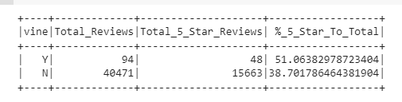

# Amazon_Vine_Analysis
# Overview of the analysis: Explain the purpose of this analysis.
I’ve been tasked with a larger project: analyzing Amazon reviews written by members of the paid Amazon Vine program. The Amazon Vine program is a service that allows manufacturers and publishers to receive reviews for their products. Companies like SellBy pay a small fee to Amazon and provide products to Amazon Vine members, who are then required to publish a review. In this project, I pick amazon_reviews_us_Video_Games and use PySpark to perform the ETL process to extract the dataset, transform the data, connect to an AWS RDS instance, and load the transformed data into pgAdmin. Next, I use PySpark, Pandas, or SQL to determine if there is any bias toward favorable reviews from Vine members in your dataset. 
# Results

### How many Vine reviews and non-Vine reviews were there?
the vine reviews are 94 and non vine are 40,471
### How many Vine reviews were 5 stars? How many non-Vine reviews were 5 stars?
the vine reviews are 48 and non vine are 15663
### What percentage of Vine reviews were 5 stars? What percentage of non-Vine reviews were 5 star
the vine reviews are 51.1 and non vine are 38.7
# Summary
Based on the analysis, it shows a positive bias towards the vine program. The graph shows that 51.1 percent of vine reviwes are 5 star reviews and 38.7% are not vine reviews. Also, this can be because they are getting a free product and they are more than happy to write a good review. Also, we need to take in consideration how much time does a vine customer has to write a review in amazon? a amonth? what if the product failed after two? .However, we need to add more data (mean,median,mode). This can be helpful to see if the data is skewed left or right.
